# Git Env Vault - Модулі та Команди

## Огляд модульної структури

```mermaid
graph TB
    subgraph Entry Points
        CLI[CLI Index]
        TUI[TUI Entry]
    end
    
    subgraph Commands
        INIT[init]
        PULL[pull]
        EDIT[edit]
        SET[set]
        DOCTOR[doctor]
        CI[ci verify]
        GRANT[grant]
        REVOKE[revoke]
        ROTATE[rotate]
        UPDATE[updatekeys]
    end
    
    subgraph TUI Flows
        TF1[Secrets Editor Flow]
        TF2[User Management Flow]
        TF3[Setup Wizard Flow]
    end
    
    subgraph Core Modules
        CONFIG[Config]
        ENV[Env]
        SOPS[SopsAdapter]
        POLICY[Policy]
        GIT[GitAdapter]
        FS[FileSystem]
    end
    
    CLI --> Commands
    CLI --> TUI
    TUI --> TF1
    TUI --> TF2
    TUI --> TF3
    
    Commands --> Core Modules
    TUI Flows --> Core Modules
```

---

## CLI Commands

### 1. `git-env-vault init`

Ініціалізація проекту git-env-vault.

```bash
git-env-vault init [options]

Options:
  --interactive    Запустити інтерактивний wizard
  --envs <list>    Список середовищ (dev,uat,prod)
  --services <list> Список сервісів
  --force          Перезаписати існуючу конфігурацію
```

**Алгоритм:**

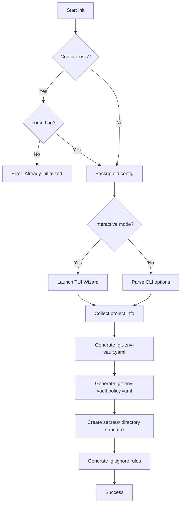

**Файлові операції:**
- Створює `.git-env-vault.yaml`
- Створює `.git-env-vault.policy.yaml` (порожній, підписаний)
- Створює `secrets/{env}/` директорії
- Оновлює `.gitignore`

---

### 2. `git-env-vault pull`

Розкладає зашифровані секрети по .env файлах монорепозиторію.

```bash
git-env-vault pull <environment> [options]

Arguments:
  environment      Цільове середовище (dev, uat, prod)

Options:
  --service <name> Пуллити тільки конкретний сервіс
  --dry-run        Показати що буде зроблено без виконання
  --overwrite      Перезаписати існуючі .env файли
  --format <type>  Формат виводу (dotenv, json, yaml)
```

**Алгоритм:**

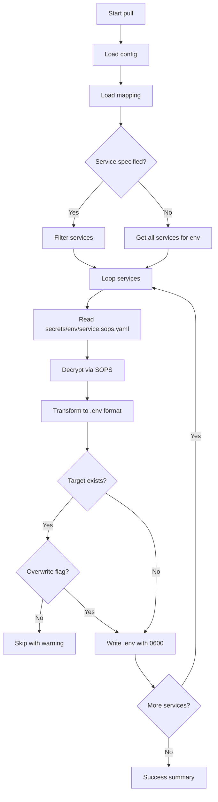

**Приклад виводу:**

```
✓ Pulled 3 secrets for environment 'dev'
  services/api/.env      (12 variables)
  services/worker/.env   (8 variables)
  apps/web/.env.local    (5 variables)
```

---

### 3. `git-env-vault edit`

Інтерактивне редагування секретів з workflow: decrypt → edit → validate → encrypt → diff → commit.

```bash
git-env-vault edit <environment> <service> [options]

Arguments:
  environment      Середовище (dev, uat, prod)
  service          Назва сервісу

Options:
  --editor <cmd>   Редактор (default: $EDITOR or nano)
  --no-commit      Не робити автокоміт
  --no-diff        Не показувати diff
```

**Алгоритм:**

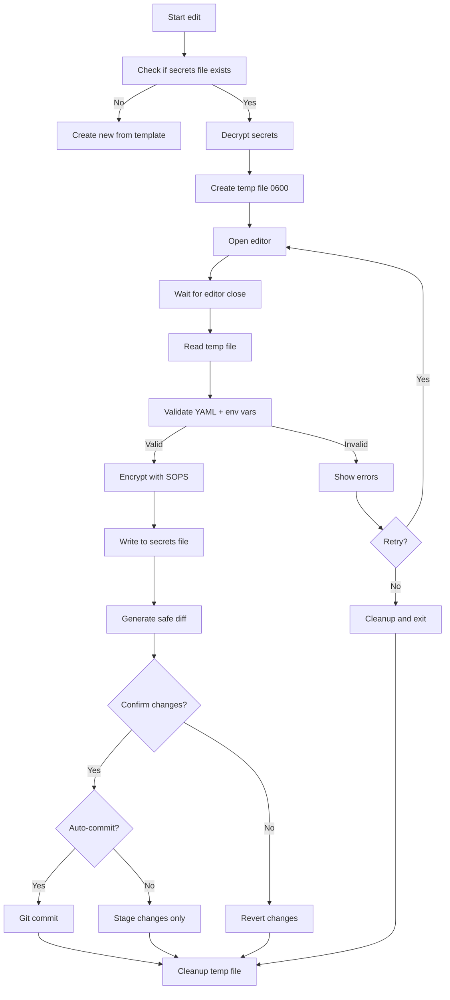

**Валідація:**
- YAML синтаксис
- Коректні імена змінних (A-Z_, 0-9)
- Відсутність вкладених структур у data
- Попередження про потенційні проблеми (дублікати, порожні значення)

---

### 4. `git-env-vault set`

Швидке встановлення окремої змінної без відкриття редактора.

```bash
git-env-vault set <environment> <service> <key=value> [options]

Arguments:
  environment      Середовище
  service          Сервіс
  key=value        Змінна у форматі KEY=VALUE

Options:
  --from-file <path>  Взяти значення з файлу
  --from-stdin        Взяти значення з stdin
  --delete           Видалити змінну
```

**Приклади:**

```bash
# Встановити змінну
git-env-vault set dev api DATABASE_URL=postgres://localhost:5432/dev

# Взяти значення з файлу
git-env-vault set prod api PRIVATE_KEY --from-file ./key.pem

# Видалити змінну
git-env-vault set dev api OLD_VAR --delete
```

---

### 5. `git-env-vault doctor`

Діагностика проблем з конфігурацією та середовищем.

```bash
git-env-vault doctor [options]

Options:
  --fix            Автоматично виправити проблеми
  --verbose        Детальний вивід
  --json           JSON формат виводу
```

**Перевірки:**

| Check | Опис | Auto-fix |
|-------|------|----------|
| `sops-binary` | SOPS встановлений та доступний | Ні |
| `age-keys` | age ключі наявні та валідні | Ні |
| `config-file` | .git-env-vault.yaml існує та валідний | Так |
| `policy-file` | .policy.yaml підписаний | Ні |
| `secrets-dir` | Структура директорій коректна | Так |
| `gitignore` | .env файли в .gitignore | Так |
| `permissions` | Права доступу до файлів | Ні |

**Приклад виводу:**

```
Running diagnostics...

✓ SOPS binary found: v3.8.1
✓ age keys found: 2 keys
✓ Config file valid
✓ Policy file signed
✓ Secrets directory structure OK
⚠ .gitignore missing .env entries
  → Run with --fix to add

6 passed, 1 warning
```

---

### 6. `git-env-vault ci verify`

Перевірка цілісності для CI/CD пайплайнів.

```bash
git-env-vault ci verify [options]

Options:
  --environment <env>  Перевірити конкретне середовище
  --strict             Помилка при будь-яких warnings
  --json               JSON вивід для парсингу
  --check-recipients   Перевірити що всі recipients у policy
```

**Алгоритм:**

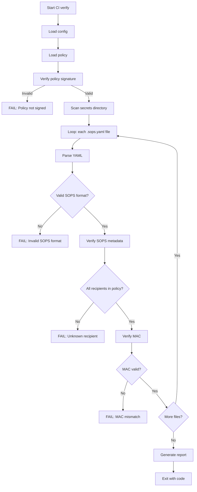

**Exit codes:**
- `0` — всі перевірки пройшли
- `1` — критичні помилки
- `2` — warnings в strict режимі

**JSON вивід приклад:**

```json
{
  "status": "passed",
  "checks": {
    "policySignature": "valid",
    "secretsFormat": "valid",
    "recipientsMatch": "valid",
    "macVerification": "valid"
  },
  "files": 12,
  "errors": [],
  "warnings": []
}
```

---

### 7. `git-env-vault grant`

Надання доступу користувачу.

```bash
git-env-vault grant <identity> [options]

Arguments:
  identity         age public key або email

Options:
  --admin          Надати admin права
  --envs <list>    Обмежити середовищами
  --services <list> Обмежити сервісами
  --expires <date> Термін дії доступу
```

**Вимоги:**
- Потрібен master admin підпис для виконання
- Або поточний користувач має admin права

**Алгоритм:**

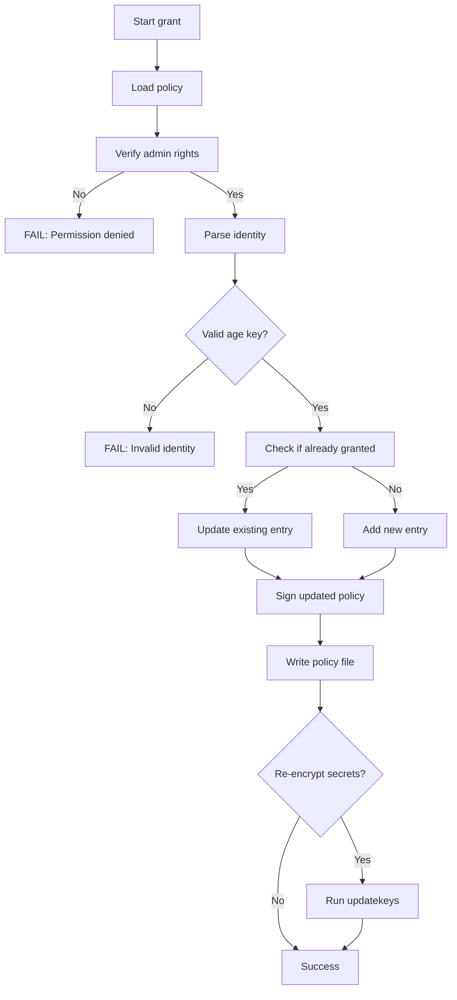

---

### 8. `git-env-vault revoke`

Відкликання доступу користувача.

```bash
git-env-vault revoke <identity> [options]

Arguments:
  identity         age public key або email користувача

Options:
  --rotate         Автоматично rotate всі секрети
  --force          Пропустити підтвердження
```

**Критично:** Після revoke обов'язковий rotate, бо відкликаний користувач міг скопіювати ключі шифрування.

---

### 9. `git-env-vault rotate**

Перешифрування всіх секретів з новими ключами.

```bash
git-env-vault rotate [options]

Options:
  --env <name>     Тільки конкретне середовище
  --service <name> Тільки конкретний сервіс
  --dry-run        Показати план без виконання
```

**Алгоритм:**

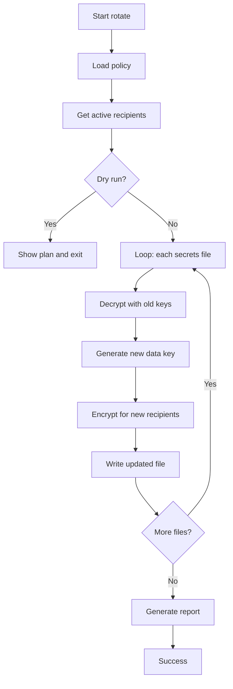

---

### 10. `git-env-vault updatekeys`

Оновлення ключів шифрування без rotate (додавання нових recipients).

```bash
git-env-vault updatekeys [options]

Options:
  --env <name>     Тільки конкретне середовище
  --service <name> Тільки конкретний сервіс
```

Використовується коли новий користувач отримав доступ через `grant` і потрібно зашифрувати data key для нього.

---

## TUI Flows

### Secrets Editor Flow

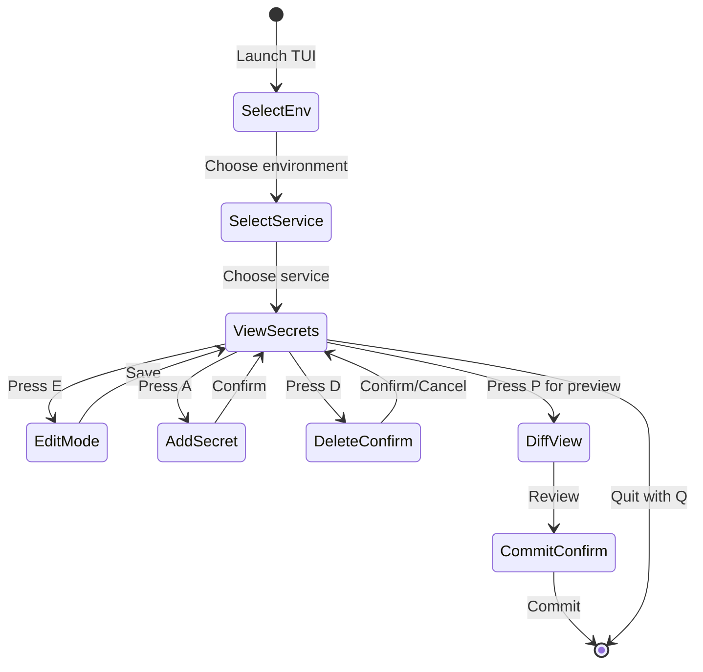

### User Management Flow

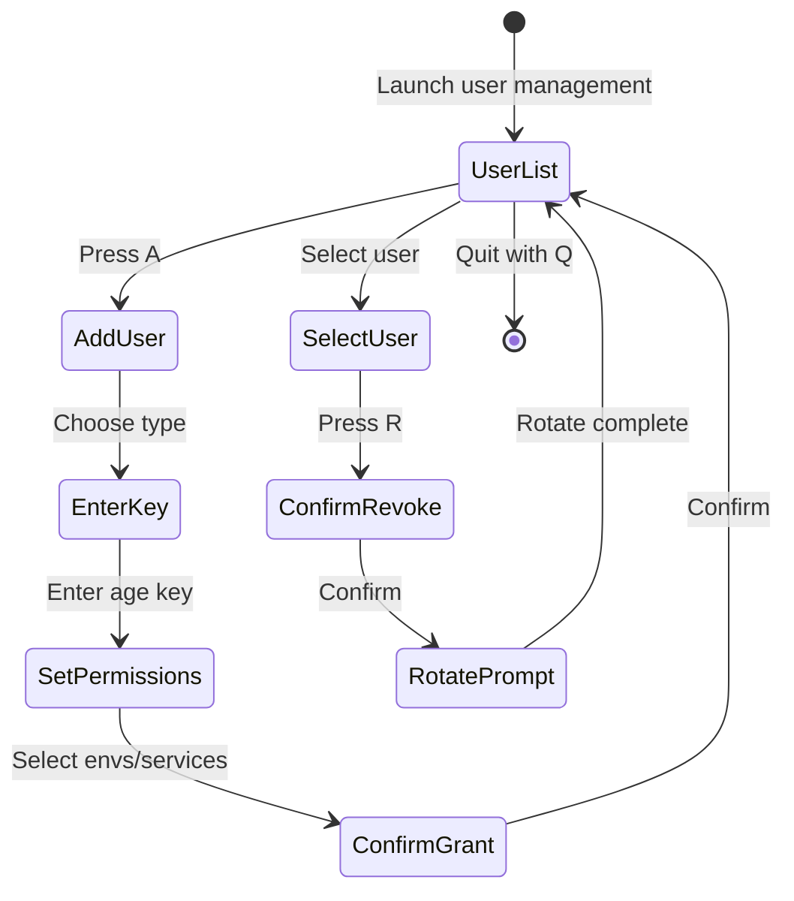

### Setup Wizard Flow

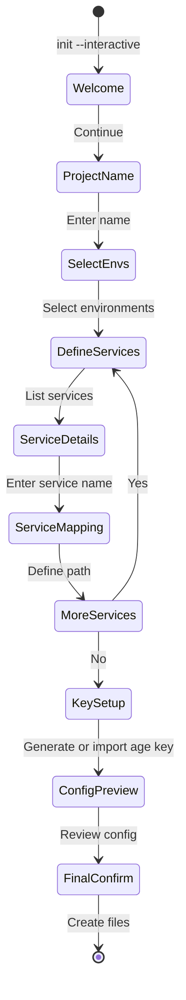

---

## Core Modules

### Config Module

**Відповідальність:** Зчитування, валідація та управління конфігурацією проекту.

```typescript
// Основні функції
export interface ConfigModule {
  load(): Promise<EnvVaultConfig>;
  save(config: EnvVaultConfig): Promise<void>;
  validate(config: unknown): ValidationResult;
  getDefaultPaths(): ConfigPaths;
}
```

**Ключові операції:**
- Завантаження `.git-env-vault.yaml`
- Мержинг з дефолтними значеннями
- Валідація схеми конфігурації
- Резолв шляхів (відносні → абсолютні)

---

### Env Module

**Відповідальність:** Робота зі змінними середовища та мапінгами.

```typescript
export interface EnvModule {
  // Парсинг .env файлів
  parseDotenv(content: string): EnvVars;
  
  // Серіалізація у .env формат
  toDotenv(vars: EnvVars): string;
  
  // Трансформація з YAML у env формат
  fromYaml(yaml: SecretsYaml): EnvVars;
  
  // Валідація імен змінних
  validateVarName(name: string): boolean;
  
  // Мапінг сервісів на шляхи
  resolveServicePath(service: string, env: string): string;
}
```

**Підтримувані формати:**
- `.env` — стандартний dotenv
- `.env.local` — локальні перевизначення
- JSON — для програмного доступу
- YAML — для складних структур

---

### SOPS Module

**Відповідальність:** Інтеграція з SOPS binary для шифрування/розшифрування.

```typescript
export interface SopsModule {
  // Розшифрування файлу
  decrypt(filePath: string): Promise<DecryptedContent>;
  
  // Шифрування контенту
  encrypt(content: object, recipients: AgeRecipient[]): Promise<string>;
  
  // Оновлення recipients без перешифрування даних
  updateKeys(filePath: string, recipients: AgeRecipient[]): Promise<void>;
  
  // Отримання metadata
  getMetadata(filePath: string): Promise<SopsMetadata>;
  
  // Перевірка чи файл зашифрований
  isEncrypted(filePath: string): Promise<boolean>;
}
```

**Інтеграція з SOPS:**

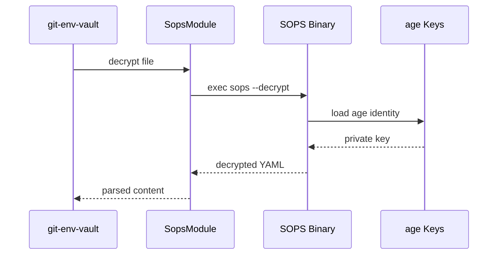

---

### Policy Module

**Відповідальність:** Управління доступами та криптографічні підписи.

```typescript
export interface PolicyModule {
  // Завантаження policy
  load(): Promise<EnvVaultPolicy>;
  
  // Збереження з підписом
  save(policy: EnvVaultPolicy, signature: Signature): Promise<void>;
  
  // Перевірка підпису
  verifySignature(policy: EnvVaultPolicy): Promise<boolean>;
  
  // Перевірка прав доступу
  checkAccess(user: string, resource: Resource): Promise<boolean>;
  
  // Додавання користувача
  grantAccess(identity: UserIdentity, rights: AccessRights): Promise<void>;
  
  // Відкликання доступу
  revokeAccess(identity: string): Promise<void>;
}
```

**Структура policy:**

```yaml
version: 1
generated: 2024-01-15T10:00:00Z

admin:
  masterKey: age1admin...  # ed25519 для підписів
  users:
    - identity: age1alice...
      name: Alice
      email: alice@example.com

users:
  - identity: age1bob...
    name: Bob
    email: bob@example.com
    access:
      - env: dev
        services: ["*"]
      - env: uat
        services: ["api"]

signature: |
  -----BEGIN SIGNATURE-----
  ...
  -----END SIGNATURE-----
```

---

### Git Module

**Відповідальність:** Git операції та safe diff.

```typescript
export interface GitModule {
  // Перевірка чи в git репозиторії
  isGitRepo(): Promise<boolean>;
  
  // Diff без секретів
  safeDiff(oldContent: SecretsFile, newContent: SecretsFile): DiffResult;
  
  // Commit змін
  commit(files: string[], message: string): Promise<void>;
  
  // Stage змін
  stage(files: string[]): Promise<void>;
  
  // Pre-commit hook
  installHook(): Promise<void>;
  
  // Перевірка незафіксованих змін
  hasUncommittedChanges(): Promise<boolean>;
}
```

**Safe Diff алгоритм:**

```typescript
function safeDiff(old: SecretsFile, new: SecretsFile): DiffResult {
  const oldKeys = Object.keys(old.data);
  const newKeys = Object.keys(new.data);
  
  return {
    added: newKeys.filter(k => !oldKeys.includes(k)),
    removed: oldKeys.filter(k => !newKeys.includes(k)),
    changed: oldKeys.filter(k => 
      newKeys.includes(k) && !equal(old.data[k], new.data[k])
    ),
    // Значення НІКОЛИ не показуємо
    valuesExposed: false
  };
}
```

---

### FileSystem Module

**Відповідальність:** Безпечна робота з файловою системою.

```typescript
export interface FsModule {
  // Читання файлу
  readFile(path: string): Promise<string>;
  
  // Запис з правильними правами
  writeFile(path: string, content: string, perms?: FilePerms): Promise<void>;
  
  // Створення temp файлу
  createTempFile(prefix: string): Promise<TempFile>;
  
  // Безпечне видалення
  secureDelete(path: string): Promise<void>;
  
  // Копіювання з правами
  copyWithPerms(src: string, dest: string): Promise<void>;
  
  // Перевірка прав
  checkPermissions(path: string): Promise<PermissionCheck>;
}
```

**Кросплатформена робота з правами:**

```typescript
interface FilePerms {
  // Unix: mode bits (0600, 0644, etc.)
  mode?: number;
  
  // Windows: ACL (опціонально)
  acl?: WindowsAcl;
}

// Приклад: створення temp файлу для секретів
async function createTempFile(prefix: string): Promise<TempFile> {
  const path = await mktemp(prefix);
  
  if (process.platform !== 'win32') {
    await fs.chmod(path, 0o600);  // Тільки власник
  } else {
    // Windows: best effort, використовуємо %TEMP% з user permissions
  }
  
  return {
    path,
    cleanup: () => secureDelete(path)
  };
}
```

---

## Залежності між модулями

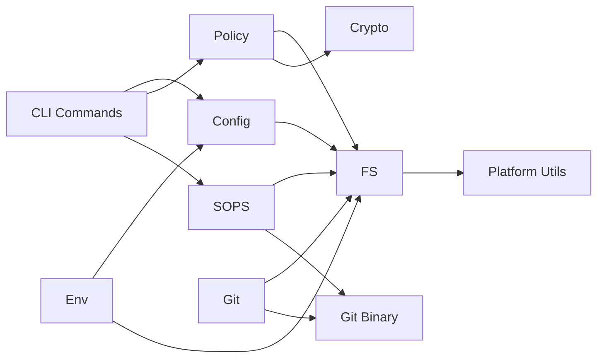

### Напрямок залежностей

1. **CLI** → Core Modules (верхній рівень)
2. **Core Modules** → FS Module (середній рівень)
3. **FS Module** → Platform Utils (нижній рівень)

### Ізоляція зовнішніх залежностей

- SOPS binary — через SopsModule adapter
- Git binary — через GitModule adapter
- age keys — через PolicyModule та SopsModule

Це дозволяє:
- Мокати зовнішні залежності в тестах
- Міняти реалізацію без зміни API
- Легко додавати нові crypto backends у майбутньому
