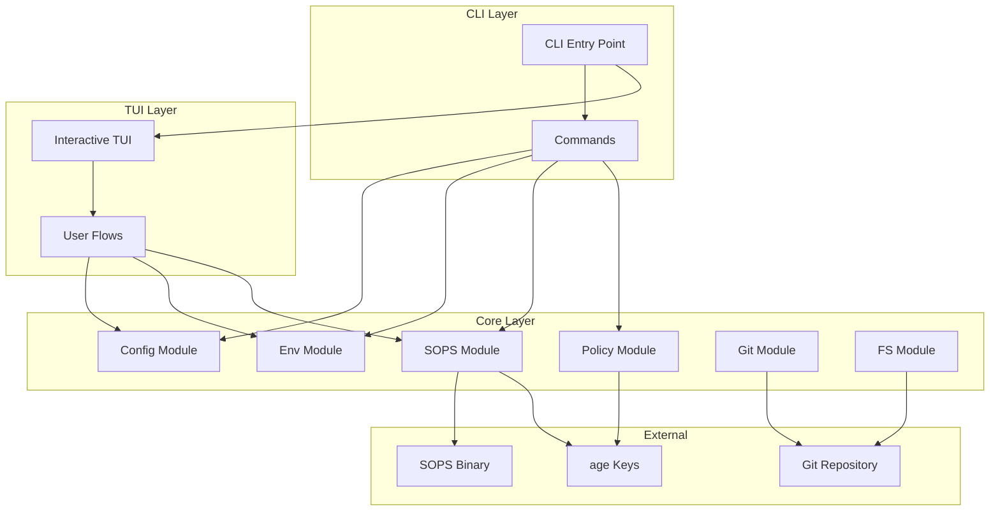
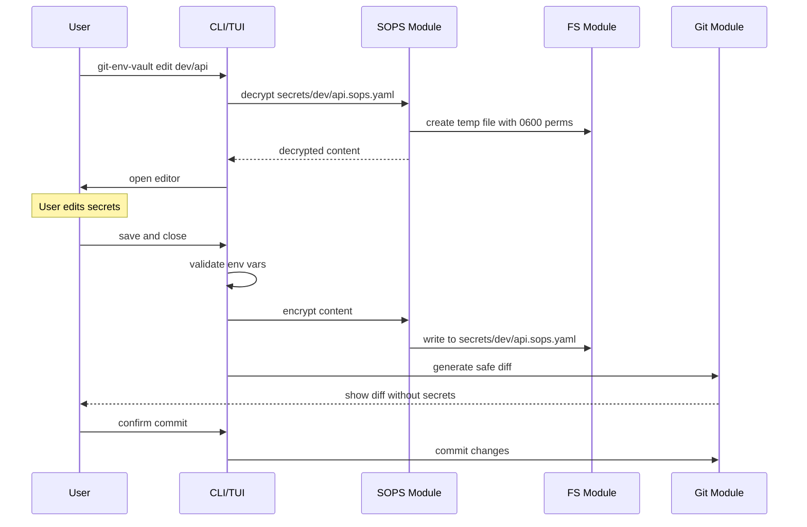
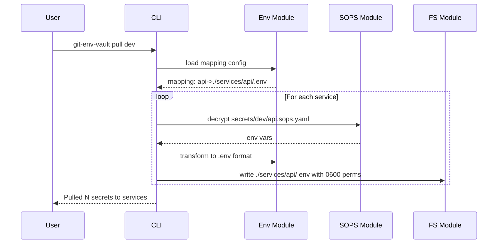
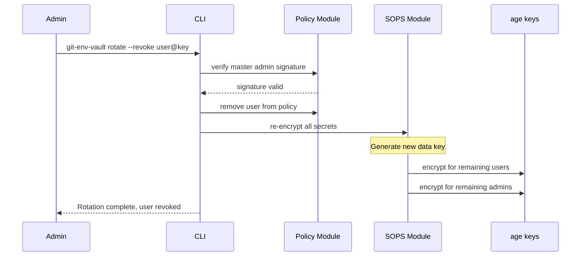

# Git Env Vault - Архітектурний Огляд

## Мета продукту

**git-env-vault** — це CLI інструмент з інтерактивним TUI для безпечного управління зашифрованими змінними середовища в монорепозиторіях. Інструмент дозволяє зберігати секрети безпосередньо в Git у зашифрованому вигляді, керувати доступом через криптографічні ключі та забезпечує безпечний робочий процес для розробників.

### Ключові можливості

- **Git-native сховище секретів** — всі секрети зберігаються в репозиторії у зашифрованому вигляді
- **Монорепозиторна підтримка** — розподіл секретів по N сервісах за мапінгом
- **Рольовий доступ** — master admin key + користувачі з різними рівнями доступу
- **CI-ready** — верифікація без доступу до секретів, блокування небезпечних операцій
- **Інтерактивний TUI** — зручний інтерфейс для щоденної роботи

---

## Ключові принципи

### 1. Безпека перш за все

```
┌─────────────────────────────────────────────────────────────┐
│  НІКОЛИ не логуємо секрети                                   │
│  НІКОЛИ не пишемо власну криптографію                        │
│  ЗАВЖДИ використовуємо SOPS + age                            │
│  ЗАВЖДИ валідуємо підписи для критичних операцій             │
└─────────────────────────────────────────────────────────────┘
```

### 2. UX для розробників

- Команди інтуїтивні: `pull`, `edit`, `set`, `doctor`
- TUI працює зі стрілками та Enter
- Зрозумілі повідомлення про помилки
- Автоматичний diff перед commit

### 3. CI-ready

- `ci verify` — перевіряє цілісність без розшифрування
- Всі маніпуляції з доступами вимагають підпису master admin
- Детерміновані результати для reproducible builds

### 4. Кросплатформеність

- Підтримка Windows, macOS, Linux
- Коректна робота з файловими шляхами
- Контроль прав доступу до тимчасових файлів (0600 на Unix)

---

## Компоненти системи



### Опис компонентів

| Компонент | Відповідальність |
|-----------|------------------|
| **CLI Layer** | Обробка аргументів, маршрутизація команд |
| **TUI Layer** | Інтерактивні flows з користувачем |
| **Config Module** | Зчитування та валідація конфігурації |
| **Env Module** | Робота з .env файлами та мапінгами |
| **SOPS Module** | Інтеграція з SOPS для шифрування/розшифрування |
| **Policy Module** | Управління доступами та підписи |
| **Git Module** | Git операції: diff, commit, hooks |
| **FS Module** | Безпечна робота з файловою системою |

---

## Потоки даних

### Основний flow: decrypt → edit → validate → encrypt → commit



### Flow: pull — розподіл секретів по монорепі



### Flow: rotate — відкликання та перешифрування



---

## Стек технологій

| Категорія | Технологія | Причина вибору |
|-----------|------------|----------------|
| Runtime | Node.js 18+ | Широка підтримка, npm ecosystem |
| Language | TypeScript | Type safety, DX |
| CLI Framework | Commander / oclif | Зрілі рішення для CLI |
| TUI | Ink / @clack/prompts | React-like TUI, accessible |
| Crypto | SOPS + age | Перевірене рішення, не пишемо своє |
| Testing | Vitest | Швидкий, ESM-native |
| Build | tsup | ESM + CJS bundles |

---

## Формат зберігання

### Структура директорії secrets/

```
secrets/
├── .git-env-vault.yaml          # Конфігурація проекту
├── .git-env-vault.policy.yaml   # Політика доступу (підписана)
├── dev/
│   ├── api.sops.yaml            # Секрети API для dev
│   ├── worker.sops.yaml         # Секрети Worker для dev
│   └── shared.sops.yaml         # Спільні секрети для dev
├── uat/
│   ├── api.sops.yaml
│   └── worker.sops.yaml
└── prod/
    ├── api.sops.yaml
    └── worker.sops.yaml
```

### Формат .sops.yaml файлів

```yaml
# Зашифрований SOPS формат
apiVersion: git-env-vault/v1
kind: Secrets
metadata:
    service: api
    environment: dev
data:
    DATABASE_URL: ENC[age...encrypted...data]
    API_KEY: ENC[age...encrypted...data]
sops:
    kms: []
    gcp_kms: []
    azure_kv: []
    hc_vault: []
    age:
        - recipient: age1...
          enc: |
            -----BEGIN AGE ENCRYPTED FILE-----
            ...
            -----END AGE ENCRYPTED FILE-----
    lastmodified: "2024-01-15T10:30:00Z"
    mac: ENC[...]
```

---

## Конфігурація проекту

### .git-env-vault.yaml

```yaml
version: 1
project: my-monorepo

# Мапінг сервісів до шляхів
services:
    api:
        path: ./services/api
        envFile: .env
    worker:
        path: ./services/worker
        envFile: .env
    frontend:
        path: ./apps/web
        envFile: .env.local

# Середовища
environments:
    dev:
        required: true
        services:
            - api
            - worker
            - frontend
    uat:
        required: true
        services:
            - api
            - worker
    prod:
        required: false  # Опціонально
        services:
            - api
            - worker

# Налаштування SOPS
sops:
    type: age
    keyDir: .age-keys  # Директорія з публічними ключами

# Git налаштування
git:
    autoCommit: false
    commitMessageTemplate: "chore(secrets): update {env}/{service}"
```

---

## Інтеграція з CI/CD

### GitHub Actions приклад

```yaml
name: Verify Secrets
on: push

jobs:
    verify:
        runs-on: ubuntu-latest
        steps:
            - uses: actions/checkout@v4
            - uses: actions/setup-node@v4
              with:
                  node-version: "20"
            - run: npm install -g git-env-vault
            - run: git-env-vault ci verify
              env:
                  AGE_PUBLIC_KEYS: ${{ secrets.AGE_PUBLIC_KEYS }}
```

### Команда `ci verify`

```bash
git-env-vault ci verify [options]

Options:
  --environment <env>  Перевірити конкретне середовище
  --strict             Блокувати при будь-яких помилках
  --json               Вивід у JSON форматі
```

**Перевірки:**
1. Всі .sops.yaml файли є валідними YAML
2. SOPS metadata присутня та коректна
3. Всі отримувачі (recipients) є в policy
4. Policy підписана валідним master admin підписом
5. Немає незашифрованих секретів в git history

---

## Обмеження та припущення

### Припущення

1. Користувачі мають встановлений SOPS binary
2. Користувачі мають age ключі в стандартних локаціях
3. Git використовується як VCS
4. Монорепозиторій має стандартну структуру

### Обмеження

1. Prod секрети — опціонально (можуть бути в зовнішньому сховищі)
2. Не підтримуємо Git LFS для секретів (поки що)
3. Windows: обмежена підтримка file permissions (best effort)
