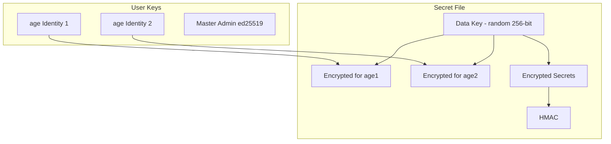
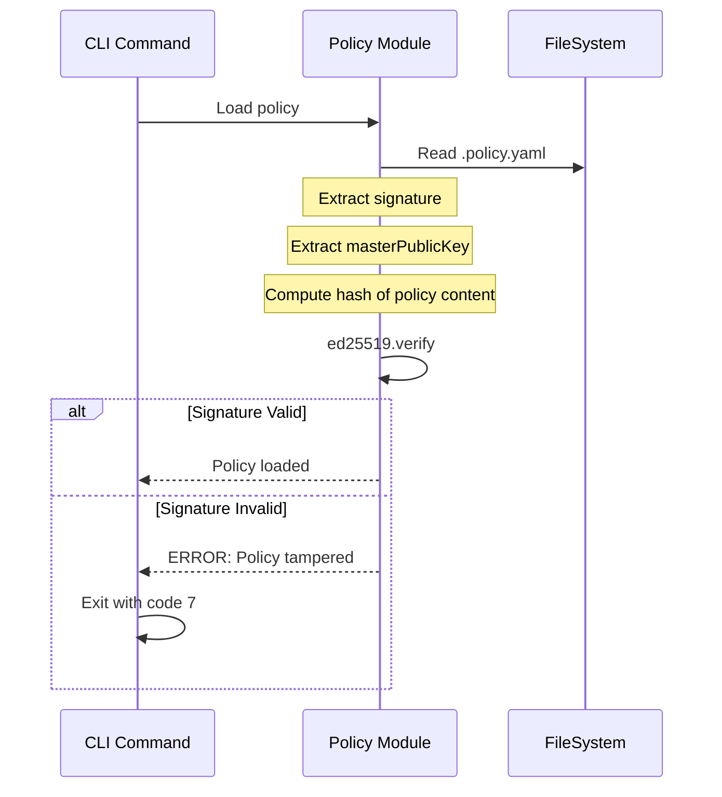
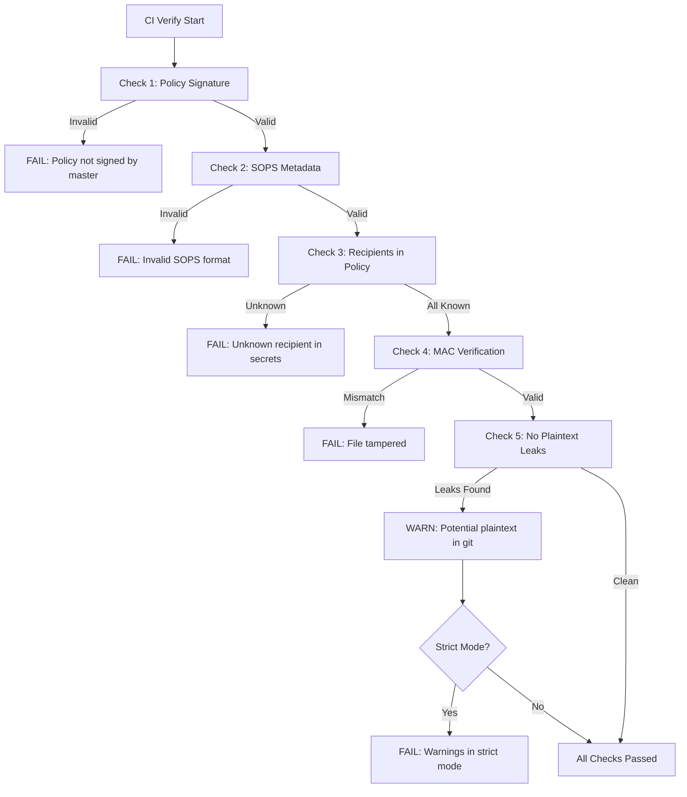
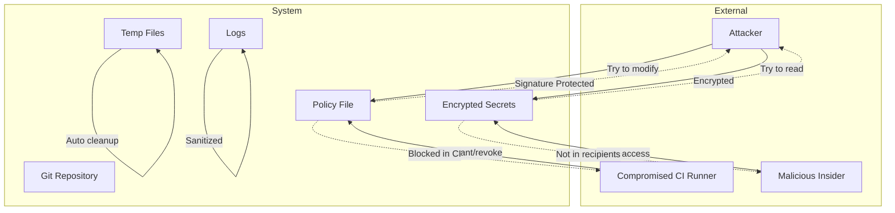

# Git Env Vault - Модель Безпеки

## Огляд

git-env-vault використовує **defense in depth** підхід до безпеки, де кожен шар забезпечує додатковий захист. Ключовий принцип: **ми НІКОЛИ не пишемо власну криптографію** — всі криптографічні операції делегуються SOPS та age.

---

## Криптографічна архітектура

### SOPS + age Integration



### Як працює шифрування SOPS

1. **Data Key Generation**: SOPS генерує випадковий 256-бітний ключ
2. **Key Encryption**: Data key шифрується для кожного recipient за допомогою age
3. **Data Encryption**: Секрети шифруються Data Key (AES-256-GCM або XChaCha20-Poly1305)
4. **MAC**: Обчислюється HMAC для цілісності

### Переваги SOPS + age

| Аспект | Перевага |
|--------|----------|
| Перевірене рішення | SOPS використовується тисячами організацій |
| Аудитована криптографія | age базується на сучасних алгоритмах |
| Key rotation | Підтримка множинних recipients |
| Infrastructure-free | Не потребує зовнішнього KMS |
| Git-friendly | Зашифровані файли — текстові YAML |

---

## Master Admin Key

### Призначення

Master Admin Key використовується для:
- Підписання policy файлу
- Авторизації критичних операцій (grant, revoke, rotate)
- Відновлення доступу

### Тип ключа: ed25519

Використовуємо ed25519 для цифрових підписів (окремо від age для шифрування):

```typescript
import * as ed from '@noble/ed25519';

// Генерація master key
async function generateMasterKey(): Promise<{private: Uint8Array, public: Uint8Array}> {
  const privateKey = ed.utils.randomPrivateKey();
  const publicKey = await ed.getPublicKeyAsync(privateKey);
  return { private: privateKey, public: publicKey };
}

// Підписання policy
async function signPolicy(policy: string, privateKey: Uint8Array): Promise<string> {
  const message = new TextEncoder().encode(policy);
  const signature = await ed.signAsync(message, privateKey);
  return Buffer.from(signature).toString('base64');
}

// Верифікація підпису
async function verifyPolicySignature(
  policy: string,
  signature: string,
  publicKey: Uint8Array
): Promise<boolean> {
  const message = new TextEncoder().encode(policy);
  const sigBytes = Buffer.from(signature, 'base64');
  return ed.verifyAsync(sigBytes, message, publicKey);
}
```

### Зберігання Master Key

```
┌─────────────────────────────────────────────────────────────┐
│  MASTER ADMIN KEY НЕ зберігається в репозиторії!            │
│                                                              │
│  Зберігання:                                                 │
│  1. Фізичний security key (YubiKey)                         │
│  2. Зашифрований файл на захищеному пристрої                │
│  3. Hardware Security Module (HSM) для enterprise           │
│                                                              │
│  НІКОЛИ:                                                     │
│  ✗ В commit історії                                         │
│  ✗ В CI/CD змінних (крім specialized runners)              │
│  ✗ В логах                                                   │
│  ✗ В shared folders                                         │
└─────────────────────────────────────────────────────────────┘
```

---

## Policy Signature Verification

### Структура Policy файлу

```yaml
# .git-env-vault.policy.yaml
version: 1
generated: 2024-01-15T10:00:00Z

# Master admin public key (ed25519)
masterKey: age1qyqsam4h5lky4...  # age key для шифрування
masterPublicKey: 6d79656b6579...  # ed25519 public key для верифікації

# Admins можуть керувати доступами
admins:
  - identity: age1admin...
    name: Admin User
    email: admin@example.com

# Звичайні користувачі
users:
  - identity: age1bob...
    name: Bob Developer
    email: bob@example.com
    access:
      - env: dev
        services: ["*"]
      - env: uat
        services: ["api", "worker"]

# Підпис (Base64 ed25519 signature)
signature: |
  -----BEGIN SIGNATURE-----
  ZXlKaGJHY2lPaUpJVXpJMU5pSjkuZXlKMGFXMWxjM1JoYlhBaU9qRTNNR0l6
  T1RRMU5qQXhJbjAuNjFwYmNoRnVhV3hzYVc1bFl5MXphV0Z1ZEcxaGJuWkRL
  -----END SIGNATURE-----
```

### Verification Flow



### Коли верифікація обов'язкова

| Операція | Верифікація | Причина |
|----------|-------------|---------|
| `pull` | Так | Потрібно перевірити що user в policy |
| `edit` | Так | Перевірка прав на конкретний сервіс |
| `grant` | Так | Критична операція |
| `revoke` | Так | Критична операція |
| `rotate` | Так | Критична операція |
| `ci verify` | Так | CI безпека |
| `doctor` | Опціонально | Діагностика |

---

## Safe Diff: Безпечне відображення змін

### Проблема

При `git diff` ми не можемо показувати зашифровані файли — вони нечитабельні. Але показувати розшифровані значення в diff — витік секретів.

### Рішення: Semantic Diff

```typescript
interface DiffResult {
  added: string[];      // Додані змінні (тільки імена)
  removed: string[];    // Видалені змінні
  unchanged: string[];  // Без змін
  changed: string[];    // Змінені значення (але НЕ показуємо значення!)
}

function generateSafeDiff(oldFile: SecretsFile, newFile: SecretsFile): string {
  const diff = computeDiff(oldFile, newFile);
  
  const lines: string[] = [];
  
  // Додані змінні
  for (const key of diff.added) {
    lines.push(`+ ${key}`);  // Зелений +, але НЕ показуємо значення
  }
  
  // Видалені змінні
  for (const key of diff.removed) {
    lines.push(`- ${key}`);  // Червний -
  }
  
  // Змінені значення
  for (const key of diff.changed) {
    lines.push(`~ ${key}`);  // Жовтий ~
  }
  
  return lines.join('\n');
}
```

### Приклад виводу

```
Changes to secrets/dev/api.sops.yaml:

  + NEW_API_KEY
  + FEATURE_FLAG_BETA
  - DEPRECATED_VAR
  ~ DATABASE_URL
  ~ REDIS_PASSWORD
  
Summary: 2 added, 1 removed, 2 changed

Commit? [y/N]
```

### Що НІКОЛИ не показується

- Значення змінних
- Довжина значень
- Паттерни значень
- Метадані шифрування

---

## Temp File Handling

### Вимоги

Тимчасові файли з розшифрованими секретами повинні:
1. Створюватися з мінімальними правами (0600 на Unix)
2. Знищуватися після використання
3. Перезаписуватися нулями перед видаленням (secure delete)

### Реалізація

```typescript
// src/core/fs/temp.ts

import { mkdtemp, writeFile, chmod, rm, open } from 'fs/promises';
import { tmpdir } from 'os';
import { join } from 'path';
import { platform } from 'os';

export interface SecureTempFile {
  path: string;
  write: (content: string) => Promise<void>;
  read: () => Promise<string>;
  cleanup: () => Promise<void>;
}

export async function createSecureTempFile(
  prefix: string = 'gev-'
): Promise<SecureTempFile> {
  const isWindows = platform() === 'win32';
  
  // Створюємо тимчасову директорію
  const tempDir = await mkdtemp(join(tmpdir(), prefix));
  const filePath = join(tempDir, 'secrets.yaml');
  
  // Unix: встановлюємо права 0700 на директорію
  if (!isWindows) {
    await chmod(tempDir, 0o700);
  }
  
  // Windows: використовуємо ACL через win-ca acl або \%TEMP% user isolation
  
  return {
    path: filePath,
    
    async write(content: string): Promise<void> {
      // Unix: права 0600 на файл
      const mode = isWindows ? 0o644 : 0o600;
      await writeFile(filePath, content, { mode });
    },
    
    async read(): Promise<string> {
      const fd = await open(filePath, 'r');
      try {
        const content = await fd.readFile({ encoding: 'utf-8' });
        return content;
      } finally {
        await fd.close();
      }
    },
    
    async cleanup(): Promise<void> {
      // Secure delete: перезаписуємо нулями
      if (!isWindows) {
        try {
          const stats = await stat(filePath);
          const zeros = Buffer.alloc(stats.size, 0);
          await writeFile(filePath, zeros);
        } catch {
          // Ignore errors during secure delete
        }
      }
      
      // Видаляємо рекурсивно
      await rm(tempDir, { recursive: true, force: true });
    }
  };
}
```

### Windows особливості

На Windows права файлів працюють інакше:

```typescript
// Windows ACL approach (optional, best-effort)
async function setWindowsAcl(filePath: string): Promise<void> {
  if (platform() !== 'win32') return;
  
  // Використовуємо icacls для обмеження доступу
  // Це best-effort, не guaranteed на Windows
  try {
    await execFile('icacls', [
      filePath,
      '/inheritance:r',
      '/grant:r',
      `${process.env.USERNAME}:(F)`
    ]);
  } catch {
    // Windows ACL may not work in all environments
    console.warn('Could not set Windows ACL for temp file');
  }
}
```

---

## CI Security Model

### Принцип: Zero Trust for CI

У CI середовищі:
- Немає інтерактивного користувача
- Немає age private keys на machines
- Тільки верифікація, не маніпуляції

### `ci verify` Command

```bash
git-env-vault ci verify [options]

Exit Codes:
  0 = All checks passed
  1 = Critical errors found
  2 = Warnings in strict mode
```

### Перевірки CI



### CI Blocking Rules

Наступні операції **блокуються** в CI:

```typescript
const BLOCKED_IN_CI = [
  'grant',      // Додавання користувачів
  'revoke',     // Відкликання доступу
  'rotate',     // Перешифрування
  'updatekeys', // Оновлення ключів
  'edit',       // Редагування (немає editor)
];

function checkCiAllowed(command: string): void {
  if (process.env.CI && BLOCKED_IN_CI.includes(command)) {
    throw new Error(
      `Command '${command}' is blocked in CI environment. ` +
      `This operation requires interactive confirmation and master admin signature.`
    );
  }
}
```

### CI Environment Detection

```typescript
function isCiEnvironment(): boolean {
  const ciIndicators = [
    'CI',
    'CONTINUOUS_INTEGRATION',
    'GITHUB_ACTIONS',
    'GITLAB_CI',
    'CIRCLECI',
    'JENKINS_URL',
    'TRAVIS',
    'BITBUCKET_BUILD_NUMBER',
  ];
  
  return ciIndicators.some(key => !!process.env[key]);
}
```

---

## Security Logging

### Що логується

```typescript
// ✓ Дозволено
logger.info('Decrypting secrets/dev/api.sops.yaml');
logger.info('User alice@example.com accessed dev/api');
logger.warn('Policy signature verification failed');
logger.error('SOPS decryption failed');

// ✗ ЗАБОРОНЕНО
logger.info(`Database URL: ${dbUrl}`);  // НІКОЛИ!
logger.debug(`Secret value: ${secret}`);  // НІКОЛИ!
```

### Sanitization Logger

```typescript
class SecurityLogger {
  private sensitivePatterns = [
    /password/i,
    /secret/i,
    /key/i,
    /token/i,
    /api.?key/i,
    /private/i,
    /credential/i,
  ];
  
  log(level: string, message: string, data?: Record<string, unknown>): void {
    const sanitized = data ? this.sanitize(data) : undefined;
    this.writeLog(level, message, sanitized);
  }
  
  private sanitize(data: Record<string, unknown>): Record<string, unknown> {
    const result: Record<string, unknown> = {};
    
    for (const [key, value] of Object.entries(data)) {
      if (this.isSensitiveKey(key)) {
        result[key] = '[REDACTED]';
      } else if (typeof value === 'string' && this.looksLikeSecret(value)) {
        result[key] = '[REDACTED]';
      } else {
        result[key] = value;
      }
    }
    
    return result;
  }
  
  private isSensitiveKey(key: string): boolean {
    return this.sensitivePatterns.some(p => p.test(key));
  }
  
  private looksLikeSecret(value: string): boolean {
    // Base64-like strings of significant length
    if (/^[A-Za-z0-9+/]{32,}={0,2}$/.test(value)) {
      return true;
    }
    
    // Connection strings
    if (/^[a-z]+:\/\//.test(value) && /:.*@/.test(value)) {
      return true;
    }
    
    return false;
  }
}
```

---

## Threat Model

### Загрози, які ми мінімізуємо

| Загроза | Мітигація |
|---------|-----------|
| Витік секретів в git history | Всі секрети зашифровані |
| Компрометація age key | Rotate + перешифрування |
| Несанкціонований доступ | Policy verification |
| Підміна policy файлу | ed25519 підпис |
| Витік через логи | Sanitization logger |
| Витік через temp файли | 0600 perms + secure delete |
| MITM на git push | Git сам забезпечує (HTTPS/SSH) |
| Компрометація CI | Блокування критичних операцій |

### Threat Model Diagram



### Що ми НЕ захищаємо від

| Загроза | Причина |
|---------|---------|
| Компрометація master admin key | Це Responsibility admin'а |
| Фізичний доступ до машини | Out of scope |
| Memory dumps під час виконання | Загальна проблема процесів |
| Compromised age binary | Supply chain attack — використовуйте trusted sources |
| Compromised SOPS binary | Supply chain attack — використовуйте trusted sources |

---

## Security Best Practices

### Для розробників

```markdown
1. НІКОЛИ не комітьте age private keys
2. НІКОЛИ не комітьте .env файли
3. Використовуйте `doctor` для перевірки конфігурації
4. Rotate ключі при зміні команди
5. Використовуйте різні ключі для різних середовищ
```

### Для адміністраторів

```markdown
1. Зберігайте master admin key в HSM або YubiKey
2. Регулярно rotate всі ключі
3. Аудит policy змін
4. Моніторинг невдалих спроб доступу
5. Backup master key в захищеному місці
```

### Для CI/CD

```markdown
1. Не передавайте age keys в CI (тільки verify)
2. Використовуйте signed commits для secrets changes
3. Блокуйте прямі зміни policy без review
4. Required status checks для secrets changes
5. Audit log для всіх CI operations
```

---

## Security Checklist

### Перед релізом

- [ ] Всі криптографічні операції через SOPS
- [ ] ed25519 підписи для policy
- [ ] Temp файли з 0600 perms
- [ ] Secure delete для temp файлів
- [ ] Sanitization logger
- [ ] CI blocking для критичних операцій
- [ ] Документація threat model
- [ ] Security review

### Для кожного PR

- [ ] Жодних hardcoded secrets
- [ ] Жодних secrets в логах
- [ ] Оновлена документація security
- [ ] Тести для security flows
