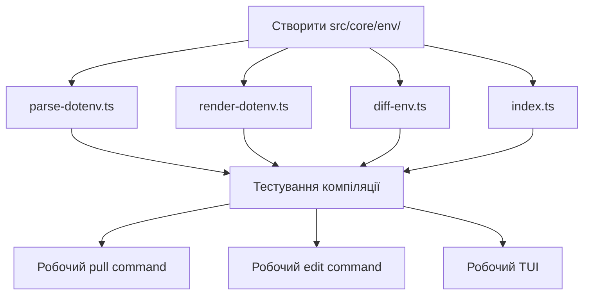
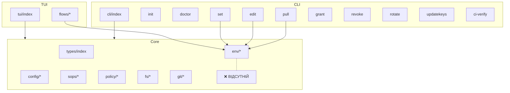

# Архітектурний аналіз проекту git-env-vault

**Дата аналізу:** 2025-01-XX  
**Версія проекту:** (див. package.json)

## 📊 Загальний статус реалізації

```
┌─────────────────────────────────────────────────────────────────┐
│                    СТАТУС ЕПІКІВ                                │
├──────────────────┬──────────────┬───────────────────────────────┤
│ Епік             │ Готовність   │ Статус                        │
├──────────────────┼──────────────┼───────────────────────────────┤
│ Epic A: Config   │ ████████ 90% │ ✅ Майже повністю             │
│ Epic B: Crypto   │ ████████ 95% │ ✅ Повністю реалізовано       │
│ Epic C: .env     │ ███░░░░░░  0% │ ❌ КРИТИЧНО ВІДСУТНІЙ         │
│ Epic D: CLI      │ ████████ 90% │ ⚠️ Залежить від Epic C        │
│ Epic E: TUI      │ ████████ 85% │ ⚠️ Залежить від Epic C        │
│ Epic F: Features │ ██████░░ 60% │ ⚠️ Частково реалізовано       │
├──────────────────┼──────────────┼───────────────────────────────┤
│ В ЗАГАЛОМ        │ ██████░░ 70% │ ❌ НЕ КОМПІЛЮЄТЬСЯ             │
└──────────────────┴──────────────┴───────────────────────────────┘
```

---

## 🔴 КРИТИЧНА ПРОБЛЕМА

### Відсутній модуль `src/core/env/`

**Проблема:** У файлі [`src/core/index.ts`](src/core/index.ts:3) є експорт:
```typescript
export * from './env/index.js'
```

Але **директорія `src/core/env/` не існує!**

**Наслідки:**
1. ❌ Проект **не компілюється**
2. ❌ Всі команди, що використовують `renderDotenv`, `parseDotenv`, `diffEnv` - не працюють
3. ❌ TUI не працює

**Використання в коді:**

| Функція | Файли-споживачі |
|---------|-----------------|
| `renderDotenv` | [`pull.ts`](src/cli/commands/pull.ts:62), [`edit.ts`](src/cli/commands/edit.ts:57), [`edit-flow.ts`](src/tui/flows/edit-flow.ts:41) |
| `parseDotenv` | [`edit.ts`](src/cli/commands/edit.ts:79), [`edit-flow.ts`](src/tui/flows/edit-flow.ts:65) |
| `diffEnv` | [`set.ts`](src/cli/commands/set.ts:57), [`edit.ts`](src/cli/commands/edit.ts:82), [`edit-flow.ts`](src/tui/flows/edit-flow.ts:68) |
| `formatSafeDiff` | [`set.ts`](src/cli/commands/set.ts:59), [`edit.ts`](src/cli/commands/edit.ts:95), [`edit-flow.ts`](src/tui/flows/edit-flow.ts:77) |
| `formatUnsafeDiff` | [`edit.ts`](src/cli/commands/edit.ts:93), [`edit-flow.ts`](src/tui/flows/edit-flow.ts:85) |

---

## 📋 Детальний аналіз по епіках

### Epic A: Формат сховища, конфіги, policy
**Готовність: 90%**

| Компонент | Файл | Статус | Примітка |
|-----------|------|--------|----------|
| Config завантаження | [`load-config.ts`](src/core/config/load-config.ts) | ✅ | Повністю реалізовано |
| Policy завантаження | [`load-policy.ts`](src/core/config/load-policy.ts) | ✅ | Повністю реалізовано |
| SOPS config генератор | [`sops-config-gen.ts`](src/core/sops/sops-config-gen.ts) | ✅ | Генерує .sops.yaml |
| Типи | [`types/index.ts`](src/core/types/index.ts) | ✅ | EnvVaultConfig, EnvVaultPolicy |
| Валідація | Вбудована | ✅ | Перевірка version, required полів |

**Що відсутнє:**
- Схеми JSON для валідації config/policy (опціонально)

---

### Epic B: Крипто-адаптер і verify
**Готовність: 95%**

| Компонент | Файл | Статус | Примітка |
|-----------|------|--------|----------|
| SOPS Adapter | [`sops-adapter.ts`](src/core/sops/sops-adapter.ts) | ✅ | Повна реалізація |
| CI Verify | [`ci-verify.ts`](src/cli/commands/ci-verify.ts) | ✅ | Перевіряє policy, .sops.yaml, файли |
| Policy Signature | [`signature.ts`](src/core/policy/signature.ts) | ✅ | ed25519 підписання |
| Canonical JSON | [`canonical-json.ts`](src/core/policy/canonical-json.ts) | ✅ | Детермінована серіалізація |

**Методи SopsAdapter:**
- ✅ `isAvailable()` - перевірка наявності SOPS
- ✅ `getVersion()` - версія SOPS
- ✅ `decrypt()` - розшифрування YAML
- ✅ `decryptToString()` - розшифрування в строку
- ✅ `encrypt()` - шифрування in-place
- ✅ `encryptData()` - шифрування даних
- ✅ `updateKeys()` - оновлення recipient-ів
- ✅ `rotate()` - ротація data key
- ✅ `isEncrypted()` - перевірка шифрування

---

### Epic C: Рендер .env з керованими блоками
**Готовність: 0%** ❌

| Компонент | Файл | Статус |
|-----------|------|--------|
| Dotenv парсер | `src/core/env/parse-dotenv.ts` | ❌ Відсутній |
| Dotenv рендерер | `src/core/env/render-dotenv.ts` | ❌ Відсутній |
| Diff утиліти | `src/core/env/diff-env.ts` | ❌ Відсутній |
| Managed blocks | - | ❌ Відсутній |
| Index експорт | `src/core/env/index.ts` | ❌ Відсутній |

**Потрібно реалізувати:**
1. `parseDotenv(content: string)` - парсинг .env з збереженням коментарів і порядку
2. `renderDotenv(data: EnvObject, options?: { order?: string[] })` - рендеринг у .env формат
3. `diffEnv(old: EnvObject, new: EnvObject)` - порівняння двох наборів змінних
4. `formatSafeDiff(diff: DiffResult)` - безпечне відображення diff (без значень)
5. `formatUnsafeDiff(diff: DiffResult, old: EnvObject, new: EnvObject)` - повне відображення diff

---

### Epic D: UX-команди
**Готовність: 90%** (не працює через Epic C)

| Команда | Файл | Статус | Примітка |
|---------|------|--------|----------|
| `init` | [`init.ts`](src/cli/commands/init.ts) | ✅ | Працює незалежно |
| `doctor` | [`doctor.ts`](src/cli/commands/doctor.ts) | ✅ | Працює незалежно |
| `pull` | [`pull.ts`](src/cli/commands/pull.ts) | ⚠️ | Використовує `renderDotenv` |
| `edit` | [`edit.ts`](src/cli/commands/edit.ts) | ⚠️ | Використовує `parseDotenv`, `renderDotenv`, `diffEnv` |
| `set` | [`set.ts`](src/cli/commands/set.ts) | ⚠️ | Використовує `diffEnv` |
| `grant` | [`grant.ts`](src/cli/commands/grant.ts) | ✅ | Працює незалежно |
| `revoke` | [`revoke.ts`](src/cli/commands/revoke.ts) | ✅ | Працює незалежно |
| `rotate` | [`rotate.ts`](src/cli/commands/rotate.ts) | ✅ | Працює незалежно |
| `updatekeys` | [`updatekeys.ts`](src/cli/commands/updatekeys.ts) | ✅ | Працює незалежно |
| `ci-verify` | [`ci-verify.ts`](src/cli/commands/ci-verify.ts) | ✅ | Працює незалежно |
| `tui` | [`tui.ts`](src/cli/commands/tui.ts) | ⚠️ | Залежить від flows |

---

### Epic E: TUI
**Готовність: 85%** (не працює через Epic C)

| Компонент | Файл | Статус |
|-----------|------|--------|
| Головний модуль | [`run.ts`](src/tui/run.ts) | ✅ |
| Select Action | [`select-action.ts`](src/tui/flows/select-action.ts) | ✅ |
| Select Env | [`select-env.ts`](src/tui/flows/select-env.ts) | ✅ |
| Select Services | [`select-services.ts`](src/tui/flows/select-services.ts) | ✅ |
| Pull Flow | [`pull-flow.ts`](src/tui/flows/pull-flow.ts) | ✅ |
| Edit Flow | [`edit-flow.ts`](src/tui/flows/edit-flow.ts) | ⚠️ |
| Set Flow | [`set-flow.ts`](src/tui/flows/set-flow.ts) | ⚠️ |
| Grant Flow | [`grant-flow.ts`](src/tui/flows/grant-flow.ts) | ✅ |
| Revoke Flow | [`revoke-flow.ts`](src/tui/flows/revoke-flow.ts) | ✅ |
| Rotate Flow | [`rotate-flow.ts`](src/tui/flows/rotate-flow.ts) | ✅ |
| Doctor Flow | [`doctor-flow.ts`](src/tui/flows/doctor-flow.ts) | ✅ |

**TUI використовує:** `@inquirer/prompts`, `ora`

---

### Epic F: Додаткові фічі
**Готовність: 60%**

| Компонент | Файл | Статус | Примітка |
|-----------|------|--------|----------|
| File Lock | [`lock.ts`](src/core/fs/lock.ts) | ✅ | `FileLock`, `withLock` |
| Safe Temp Files | [`safe-tmp.ts`](src/core/fs/safe-tmp.ts) | ✅ | `createSecureTempFile` |
| Git Adapter | [`git.ts`](src/core/git/git.ts) | ✅ | Повна реалізація |
| Diff | - | ⚠️ | Тільки типи, реалізація в Epic C |
| JSON Schema | - | ❌ | Відсутня |
| Auto-sync | - | ❌ | Відсутня |

**Git Adapter методи:**
- ✅ `isRepo()`, `status()`, `isDirty()`, `getBranch()`
- ✅ `getFileAtHead()`, `diffFile()`
- ✅ `add()`, `commit()`, `isTracked()`, `addToGitignore()`

---

## 🧪 Аналіз тестів

### Покриття тестами

| Модуль | Тести | Статус |
|--------|-------|--------|
| config/load-config | ✅ [`load-config.test.ts`](test/unit/config/load-config.test.ts) | 170 рядків, повне покриття |
| config/load-policy | ✅ [`load-policy.test.ts`](test/unit/config/load-policy.test.ts) | Присутній |
| policy/canonical-json | ✅ [`canonical-json.test.ts`](test/unit/policy/canonical-json.test.ts) | Присутній |
| policy/signature | ✅ [`signature.test.ts`](test/unit/policy/signature.test.ts) | Присутній |
| sops/sops-adapter | ✅ [`sops-adapter.test.ts`](test/unit/sops/sops-adapter.test.ts) | 208 рядків |
| sops/sops-config-gen | ✅ [`sops-config-gen.test.ts`](test/unit/sops/sops-config-gen.test.ts) | Присутній |
| fs/lock | ✅ [`lock.test.ts`](test/unit/fs/lock.test.ts) | Присутній |
| fs/safe-tmp | ✅ [`safe-tmp.test.ts`](test/unit/fs/safe-tmp.test.ts) | Присутній |
| git/git | ✅ [`git.test.ts`](test/unit/git/git.test.ts) | Присутній |
| env/* | ❌ | **Відсутні (модуль не існує)** |
| integration/commands | ⚠️ | init, doctor |
| e2e/crypto | ⚠️ [`crypto.e2e.test.ts`](test/e2e/crypto.e2e.test.ts) | Потребує RUN_E2E_TESTS=true |

**Конфігурація vitest:** поріг покриття 95% для core модулів

---

## 📋 Список відсутніх критичних компонентів

### Блокуючі (проект не компілюється):
1. **`src/core/env/`** - повний модуль відсутній
   - `parse-dotenv.ts`
   - `render-dotenv.ts`
   - `diff-env.ts`
   - `index.ts`

### Важливі (функціональність обмежена):
2. JSON Schema для config/policy (валідація)
3. Managed blocks для .env (збереження коментарів користувача)

### Опціональні:
4. Auto-sync (watch mode)
5. Backup перед змінами
6. Audit log

---

## 🎯 Рекомендації щодо пріоритетів реалізації

### Пріоритет 1 (КРИТИЧНИЙ) - Заблоковано все інше



**Потрібно створити:**

1. **`src/core/env/parse-dotenv.ts`**
   ```typescript
   interface ParseResult {
     env: EnvObject;
     order: string[];
     comments: Map<number, string>; // Опціонально для managed blocks
   }
   
   export function parseDotenv(content: string): ParseResult;
   ```

2. **`src/core/env/render-dotenv.ts`**
   ```typescript
   interface RenderOptions {
     order?: string[];
     header?: string;
   }
   
   export function renderDotenv(data: EnvObject, options?: RenderOptions): string;
   ```

3. **`src/core/env/diff-env.ts`**
   ```typescript
   export function diffEnv(old: EnvObject, new: EnvObject): DiffResult;
   export function formatSafeDiff(diff: DiffResult): string;
   export function formatUnsafeDiff(diff: DiffResult, old: EnvObject, new: EnvObject): string;
   ```

4. **`src/core/env/index.ts`**
   ```typescript
   export * from './parse-dotenv.js';
   export * from './render-dotenv.js';
   export * from './diff-env.js';
   ```

5. **Тести:** `test/unit/env/` з повним покриттям

### Пріоритет 2 - Після розблокування

1. Інтеграційні тести для всіх команд
2. E2E тести з mock SOPS
3. Документація API

### Пріоритет 3 - Покращення

1. Managed blocks (збереження коментарів)
2. JSON Schema валідація
3. Auto-sync режим
4. Audit logging

---

## 📊 Діаграма залежностей



---

## Висновок

Проект має **добру архітектуру** та **значний обсяг реалізованого коду**, але **не може бути скомпільований** через відсутність критичного модуля `src/core/env/`.

**Оцінка зусиль для виправлення:**
- Створення модуля env: ~150-200 рядків коду
- Тести: ~200-250 рядків коду
- Час: невеликий, але критичний для продовження роботи

**Наступний крок:** Перемкнутися в Code mode та реалізувати модуль `src/core/env/`.
